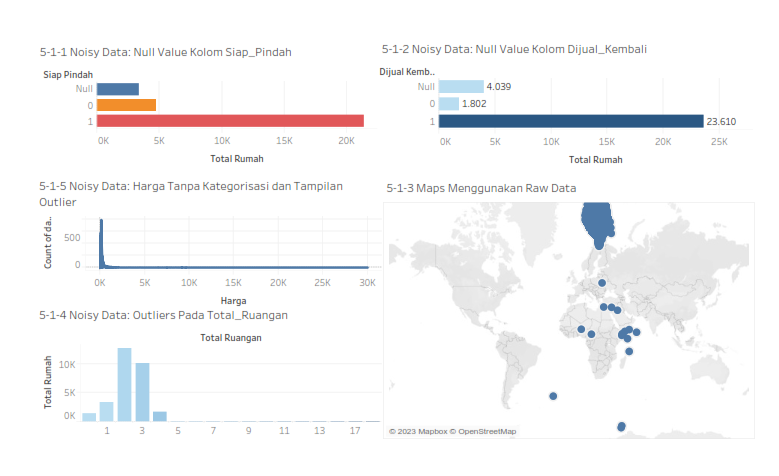
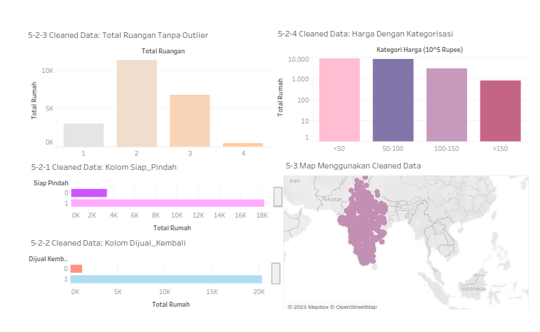

# Preview Mini Project Data Preparation Using Python and Tableau
## Authors
**Amira Husna Nur Adilah**

---
## Review
Proyek berikut menggunakan *dummy* dataset dataset_harga_rumah.csv sebagai *raw data*, kemudian dilakukan *data preparation* menggunakan Google Colaboratory dengan bahasa pemrograman Python.

Beberapa langkah yang dilakukan pada tahap *data preparation* antara lain penanganan *null values*, *outlier*, *duplicated data*, dan *noisy data*.

Berikut merupakan hasil visualisasi data menggunakan Tableau terhadap dataset sebelum dan sesudah melalui tahap data preparation.

### Sebelum

### Sesudah

Terkait laporan dan tahapan pengerjaan secara lebih detail dapat dilihat melalui file Report.pdf.

Regards,

Amira